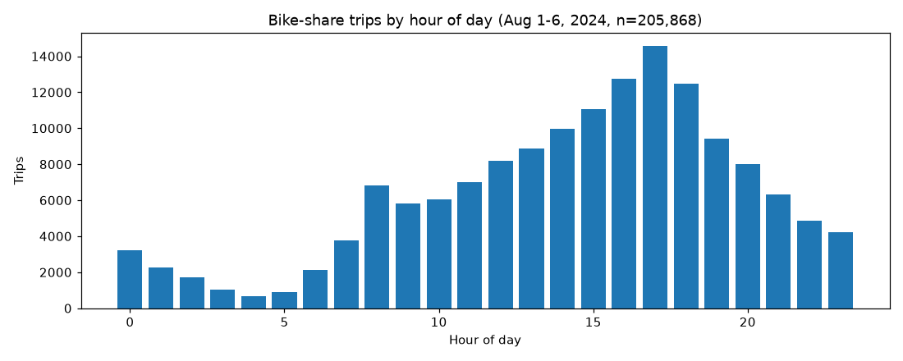
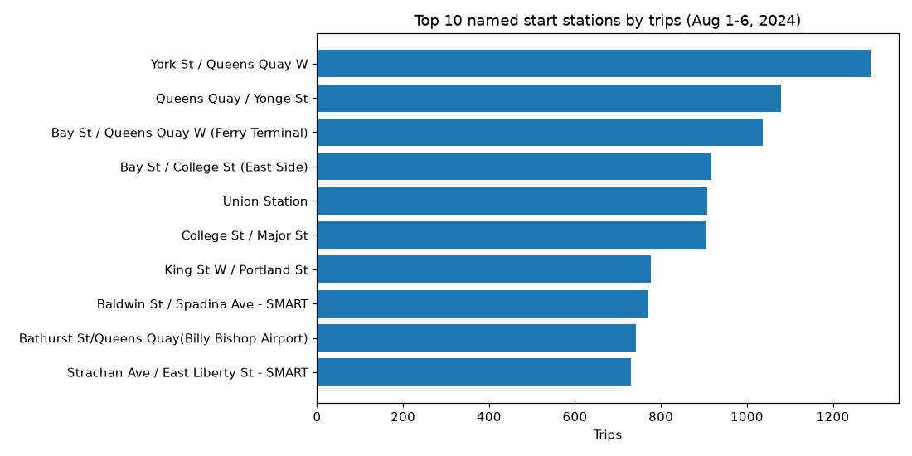
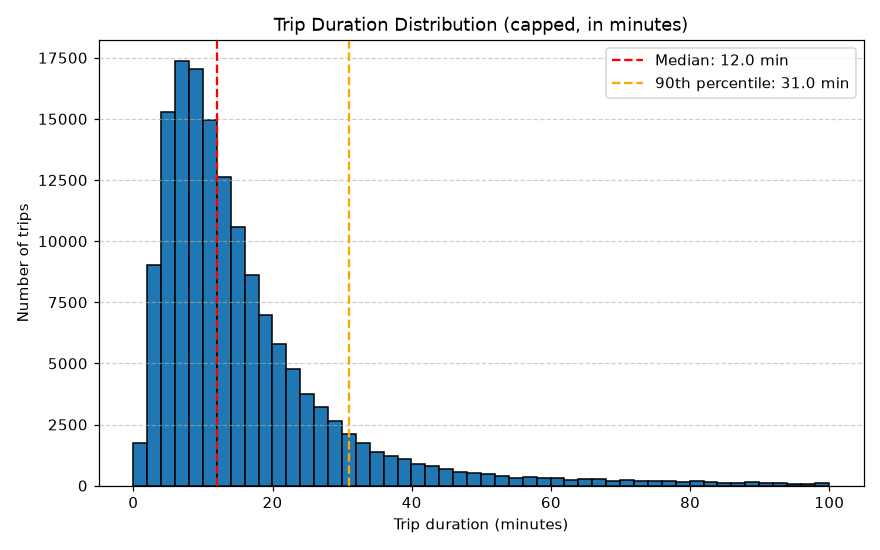

# Toronto Bike-Share Analytics

**Question:** When and where is Toronto's bike-share system under the most pressure, and who is riding?

End-to-end analytics pipeline for Toronto bike-share trip data: cleaning, ridership analysis, visualizations, a Streamlit dashboard, and analytical SQL. Built with Python, pandas, and pytest using test-driven development.

## Key findings

205,868 trips, August 1–6, 2024, across 793 named stations.

- **Evening commute peak:** demand tops out at 17:00 (14,572 trips), with 16:00–18:00 the busiest window. The quietest hour is 04:00 (647 trips).
- **Waterfront concentration:** the top stations cluster around Queens Quay — York St / Queens Quay W (1,288 trips), Queens Quay / Yonge St (1,080), and the Ferry Terminal (1,037) lead.
- **Short hops dominate:** 75.1% of trips are under 20 minutes (median 12.1 min); only 6.7% exceed 40 minutes.
- **Casual riders drive volume:** 91.2% of attributed trips are Casual Members (avg 18.1 min) vs 8.8% Annual Members (avg 11.4 min).
- **Data gap:** 28.2% of trips cannot be attributed to a station (missing ids/names or placeholder values in the source extract) — station-level analysis excludes these.





## Dataset

`data/bike_sharing.csv` — trip-level extract in the Bike Share Toronto open-data schema (11 columns: trip id, duration, start/end station ids and names, start/end times, bike id, user type, bike model), covering 2024-08-01 to 2024-08-06. The original portal export is not recorded in the repo; the file as provided is the canonical input — an earlier copy named `bike sharing.csv` (Windows line endings, identical content) was consolidated into this file.

## Cleaning rules

Documented in `src/data_processing/clean.py` and `docs/data_model.md`:

1. Column names stripped of leading/trailing whitespace (`Trip  Duration` keeps its internal double space, which downstream code expects).
2. Missing station names are resolved from a station-id → station-name mapping built from rows where the name is known; blanks and placeholders (`NULL`, `None`, `nan`) count as missing. Unresolvable names become `Unknown`.
3. Timestamps parsed to datetime; invalid values coerced to missing.
4. Cleaning works on a copy and never mutates the input.

## SQL analysis

`sql/` holds five analytical queries that answer the business questions above — each verified against the full dataset (results quoted in the table there). `docs/data_model.md` documents the table, the cleaning rules, and a Power BI star-schema mapping (fact + station/time/user/bike dimensions, DAX measures) for a planned `.pbix` build.

## Dashboard

Interactive Streamlit dashboard with sidebar filters (date range, station, user type), KPIs (total trips, unique stations, busiest hour), peak-hour charts, top stations, duration distribution, and data preview.

The dashboard lives in `src/dashboard/` — this is the authoritative app. (An older prototype in `src/Dashboard/` was removed; it referenced modules that no longer exist.)

Launch it:

```
streamlit run src/dashboard/app.py
```

Verified working: the app starts and serves successfully.

## Installation

```
git clone https://github.com/poudelabhiyan/toronto-bike-share-analytics.git
cd toronto-bike-share-analytics
pip install -r requirements.txt
```

## Running tests

```
pytest
```

23 tests, all passing. They cover loading, cleaning (including the station-name resolution), peak-hour analysis, duration categorization, station usage, and visualizations.

## Project structure

- `data/` — `bike_sharing.csv` dataset
- `src/data_processing/` — load, clean, summary, visualize modules
- `src/analysis/` — peak hours, duration categorization, station usage
- `src/dashboard/` — Streamlit app
- `src/visualization/` — chart utilities
- `sql/` — analytical SQL queries with a run guide
- `docs/` — figures, data model, and Power BI notes
- `tests/` — pytest suite
- `requirements.txt` — Python dependencies

## Limitations

- Six days of August data: findings describe a summer week, not the full year — winter demand patterns will differ.
- 28.2% of trips lack station attribution, so station rankings undercount true demand.
- 26.1% of rows in the extract are sparse (no trip details); volume totals include them but breakdowns exclude them.

## My contribution

Solo project: pipeline design, cleaning rules, analysis modules, the Streamlit dashboard, the SQL layer, tests, and documentation.
